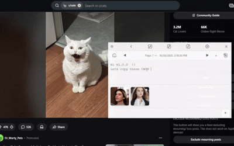

Pimo — tiny always-on-top popup notes for Windows
===============================================

[](https://youtu.be/q8wWPxYlZ78)
Yes, another notes app — but this one is opinionated and tiny. Pimo is a minimal, always-on-top popup note editor for Windows with these sweet features:

- Frameless, draggable popup window (slide-to-side / small / maximize / minimize)
- Auto-save every 5s + manual Save (Ctrl+S)
- Pages: create / next / prev / delete
- Drag & drop images (from Explorer or browser) → thumbnails and modal preview
- Images stored inline (data: URLs) in saved JSON (easy to move later)
- Settings modal shows static "About / credits" information (author, contact, donate link)
- Export / Import JSON of all data
- Packaged as a single Windows NSIS installer (.exe) (see packaging section)

This repository contains a small Electron app (main + renderer) and a simple UI.


Quick TL;DR (for impatient humans)
----------------------------------

1. Install dependencies: open PowerShell in the project root:

```powershell
npm install
```

2. Run in development:

```powershell
npm start
```

3. Make icon (if you provide icon-256x256.png):

```powershell
npm run make-icon
```

4. Build Windows installer (.exe):

```powershell
npm run dist
```

If you want to contribute, read the Contributing section below. If you want to run the app only as a user, use the produced installer in `dist/`.

Download the latest release
---------------------------

Prefer a one-click installer? Grab the latest Windows installer on the Releases page:

https://github.com/higgn/pimo-popup-notes/releases/latest

If you publish an installer in Releases, the badge at the top will automatically reflect the latest tag.

Why Pimo exists
---------------

Because sometimes you want a note that doesn't scream "look at my task manager" — just pop it up, jot something, drop a screenshot, and slide it away. Also because I like fiddling with drag-and-drop edge cases.

File layout (important bits)
----------------------------

- `main.js` — Electron main process. Creates the frameless window, IPC handlers, and save-to-disk logic. Saves `pimo-data.json` into Electron's `app.getPath('userData')` (platform-dependent).
- `renderer.js` — UI logic: pages, images, drag/drop normalization, settings wiring.
- `index.html` / `styles.css` — markup & styling for the popup UI.
- `scripts/make-icon.js` — helper to create `icon.ico` from `icon-256x256.png`.
- `package.json` — npm scripts and `electron-builder` configuration.

Where data is stored
--------------------

Pimo writes a JSON file named `pimo-data.json` into the Electron user data directory (Windows example):

C:\Users\<you>\AppData\Roaming\Pimo\pimo-data.json

The file contains a `pages` array and (new) a `settings` object with the About/author fields you enter in the Settings modal.

Important technical note: images are currently stored inline as data: URLs inside the JSON. This keeps the implementation simple and portable but can increase file size if you paste many screenshots. There's a suggested migration path in the DEVELOPMENT section.

Development: run & live-edit
----------------------------

1. npm install
2. npm start
3. Edit `renderer.js` / `index.html` / `styles.css` — the app will reload during development depending on how you prefer to test (we don't ship hot-reload here; restarting is quick).

Packaging for Windows (create installer)
---------------------------------------

This project uses `electron-builder` (configured in `package.json`) to produce an NSIS installer (.exe).

Prerequisites:
- Node >= 16 (recommended), npm
- On Windows: powershell.exe is the default shell in the examples below

Commands (PowerShell):

```powershell
# generate icon.ico from provided PNG (optional but recommended)
npm run make-icon

# build installer for Windows (x64)
npm run dist
```

Artifacts are emitted to `dist/`. The important file is `dist\\Pimo Setup <version>.exe`.

Tip: include the installer as a Release asset (see "Download the latest release" above) and optionally provide a SHA256 checksum in the release notes.

Signing the installer
---------------------

The installer produced by the above command is unsigned. To avoid SmartScreen warnings and look professional, sign the installer with an EV code-signing certificate.

Signing is outside the scope of this README (you need a certificate and vendor account). If you want help wiring automatic signing in CI, open an issue/PR and we'll add guidance.

Settings — "About" and Credits
-------------------------------

Open Settings (⚙️) in the app. The Settings modal displays static About / credits information by default:

- Author / Team name (shown as "higgn")
- Contact email (dummy example shown in the shipped build)
- Website / repo URL (dummy example shown in the shipped build)
- Donate link (dummy example shown in the shipped build)
- Short About / credits blurb

These values are currently static in the shipped app; if you fork the repo you can update the static strings in `index.html` or reintroduce editable fields in `renderer.js` and save them into `data.settings` if you prefer.

Contributing (yes please)
-------------------------

If you want to help make Pimo better, fork and send PRs. A few suggested low-risk improvements:

- Move images out of the JSON and store them as files under `userData/images/`, replacing data URLs with paths (see MIGRATION below).
- Add small non-blocking toasts for save success / errors.
- Add preferences for auto-save interval and whether images should be embedded or saved to disk.
- Add unit tests for helper functions (image normalization, drag/drop parsing).

When opening a PR:
- Keep changes small and focused.
- Run `npm install` and `npm start` locally to sanity-check.
- Add or update a small entry in this README when you change user-facing behavior.

MIGRATION (images -> disk)
---------------------------

If you or contributors want to migrate images to the disk to reduce JSON size, here's a safe approach:

1. On load, detect images stored as data URLs in `data.pages[*].images`.
2. For each data URL, write it to `path.join(app.getPath('userData'), 'images', '<sha1>.png')` (choose extension from MIME) and replace the entry with the relative file path.
3. Update any existing code that expects data URLs to read file contents when rendering images (renderer can show `file://` URLs or read then convert to object URLs).

I can implement this as a small migration if you want — open an issue or ask in the repo.

Project license
---------------

This repository uses the MIT license (friendly and permissive). Add your own license if you prefer otherwise.

Suggested repo metadata before publishing
----------------------------------------

- Add a descriptive `description` and `author` fields to `package.json`.
- Add `repository` pointing to the GitHub repo (url, type).
- Add `keywords` like `electron`, `notes`, `always-on-top`, `pimo`.

Small developer notes & tips
---------------------------

- Ctrl+S saves manually. The green save dot in the title bar briefly pulses when the app successfully saves.
- The Settings modal currently displays static About/credits info (author: higgn). If you fork the repo you can update those strings in `index.html`.
- When dragging images from a browser that provides HTML, the app parses `` and fetches remote images when necessary.

Publishing checklist
--------------------


- [ ] Add repository metadata to `package.json`.
- [ ] Create a `CHANGELOG.md` if you want to track versions.
- [ ] Add CI (GitHub Actions) to build and optionally sign artifacts.
- [ ] Add issue templates and contributor guidelines.

If you want, I can prepare a GitHub Actions workflow to automatically build installers on push or per-release (great next step).


Contact / Credits
-----------------

This project was crafted with keyboard coffee and a stubborn love of little tools. Author: higgn (GitHub: https://github.com/higgn). The app currently shows static contact info by default; replace with your details in the source if you fork.

Have fun. hehe deleted this 😏

---

